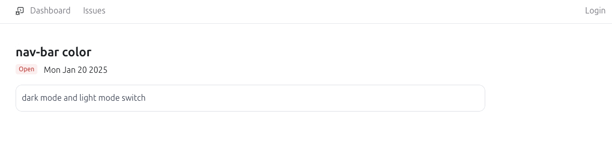

# Fix Tracker
A full-stack, production-grade bugs and issues tracker with Next.js, Typescript, Tailwind, Radix UI, Prisma, and MySQL.

## Dashboard


## Open Issues


## Issue Details


## Authentication - to add an Issue


## Getting Started

Follow these steps to set up and run the application:

1. **Clone the Repository**  
   Clone this repository to your local machine:
   ```bash
   git clone https://github.com/GudiVaraprasad/fix-track.git
   ```

2. **Configure Environment Variables**  
   - Navigate to the project folder.
   - Set all required environment variables as required in the `.env` file.

3. **Install Dependencies**  
   Run the following command to install all necessary dependencies:
   ```bash
   npm install
   ```

4. **Set Up the Database**  
   Generate the database tables using Prisma migrations:
   ```bash
   npx prisma migrate dev
   ```

5. **Start the Development Server**  
   Launch the web server:
   ```bash
   npm run dev
   ```

Your application should now be running locally.
